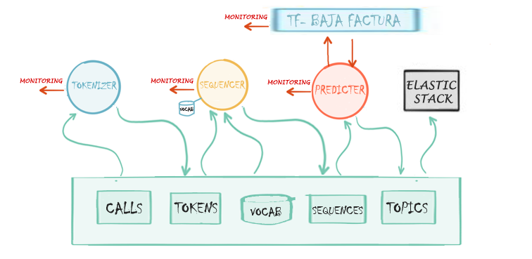

# topicmodel-callcenter-stream
Servicios de Kafka Streams para el TFM modelización de temas de llamadas en tiempo real. El código aquí 
presentado forma el *core* de la capa de *streaming* del proyecto. 

La documentación completa del TFM está accesible en https://github.com/...

Los servicios contenidos en este código son: 

## Tokenizer
Este microservicio tiene como entrada las llamadas transcritas que llegan al bus en tiempo real. A 
partir del texto de las mismas el sistema inicia un proceso de *tokenizacion* eliminando *stopwords*, 
carácteres especiales (signos de puntuación, 'ñ's, acentos...), palabras comunes, 
números, nombres propios y pasando a minúscula cada uno de los tokens.  El 
proceso de *tokenización* pretende ser lo más fiel posible al proceso realizado en Python durante 
la etapa de entrenamiento del modelo.

Una vez obtenida la lista de *tokens* esta se vuelve a disponibilizar en el bus en un nuevo *topic*. Este nuevo *topic* con las llamadas *tokenizadas* puede ser de utilidad no solo para nuestro sistema, si no también para cualquier otro sistema de análisis de texto que necesite partir de los datos *tokenizados*.

El *topic* de entrada del microservicio  *Tokenizer*, llamado *CALLS*, tendrá 
como clave el código de la llamada y como cuerpo un objeto *json* con los siguientes campos:

-  **co_verint** : Código de la llamada. 
-  **call_text** : Texto de la llamada. 
-  **call_timestamp**: Hora de la llamada.
-  **province**: Provincia desde la que se ha realizado la llamada. 
-  **co\_province**: Código de provincia desde la que se ha realizado la llamada. 
-  **duration**: Duración en segundos de la llamada. 
-  **control_type**: De existir, tipo de llamada (usado para el proceso de verificación). 
 

Como salida escribirá en un *topic*  llamado *TOKENS.CALLS* un evento cuya clave será el código 
de la llamada y cuyo cuerpo un objeto *json* con los siguientes campos:

- **co_verint** : Código de la llamada. 
- **call_text** : Texto de la llamada. 
- **call_timestamp**: Hora de la llamada.
- **province**: Provincia desde la que se ha realizado la llamada. 
- **co_province**: Código de provincia desde la que se ha realizado la llamada. 
- **duration**: Duración en segundos de la llamada. 
- **control_type**: De existir, tipo de llamada (usado para el proceso de verificación).  
- **tokens**: Lista de tokens extraída de *call_text*. 

## Sequencer
Este microservicio toma como entrada la salida del microservicio anterior y a partir de la lista de *tokens* devuelve una secuencia de tamaño fijo determinado *T*. Para ello, utiliza un diccionario en el que cada *token* se corresponde con un número, utilizando el *0* para *tokens* que no existan en este diccionario. Esta secuencia esta limitada a un tamaño determinado *T*, por lo que llamadas con un número mayor de *tokens* son recortadas y se utiliza *padding* por la izquierda para completar la secuencia de llamadas con un tamaño menor a *T*.

El diccionario ha sido calculado sobre el conjunto de datos de  entrenamiento y contiene el vocabulario del modelo. Este diccionario contiene como clave todos los *tokens* posibles y como valores el identificador usado para cada *token*. La lectura del mismo se realiza desde el mismo bus, utilizando la funcionalidad *KTable* de \textit{Kafka Streams}.

Una vez obtenida la secuencia de caracteres, esta se disponibiliza en un nuevo *topic* del bus. Además de por nuestro sistema, este valor puede ser consumido por otros microservicios o sistemas que tengan como objetivo aplicar diferentes modelos a las secuencias obtenidas.

El *topic* de entrada del microservicio *Sequencer* será el topic  *TOKENS.CALLS* descrito en el apartado anterior. 

Como salida escribirá en un *topic*  llamado *SEQUENCES.CALLS* un evento cuya clave será el código de la llamada y cuyo cuerpo un objeto *json* con los siguientes campos:

- **co\_verint** : Código de la llamada. 
- **call\_text** : Texto de la llamada. 
- **call\_timestamp**: Hora de la llamada.
- **province**: Provincia desde la que se ha realizado la llamada. 
- **co\_province**: Código de provincia desde la que se ha realizado la llamada. 
- **duration**: Duración en segundos de la llamada. 
- **control\_type**: De existir, tipo de llamada (usado para el proceso de verificación).  
- **sequence**: Lista de 866 enteros en el que cada uno representa el identificador de un *token*. La secuencia se completa con ceros en caso de ser necesario.

Además se apoyará en un topic compacto que no tendrá  límite de retención, denominado \newline *TBL.VOCABULARY.CALLS*, cuya clave son los *tokens* existentes en el vocabulario y,  cuyo  valor es un identificador para cada uno de ellos.

## Predicter

Este último microservicio tiene como entrada el *topic* generado por **Sequencer** y a partir del mismo realiza una llamada a **tf-BajaFactura**. Una vez obtenidas las predicciones, las enriquece con las etiquetas necesarias. Además en el caso de existir un atributo de control comprueba si la predicción ha sido correcta, esto nos servirá para validar la eficiencia del modelo a lo largo del tiempo. 

Como podemos observar, es el único microservicio que tiene una dependencia con otro (*tf-BajaFactura*), sin embargo la API de un modelo implementado con Tensorflow Serving \cite{tfserving} es siempre idéntica. Esto provoca que la llamada no varíe aunque cambie el modelo. Además, en el servicio **Predicter**, el número de clases y las etiquetas de las mismas son configurables , pudiendo  reutilizarse este microservicio para cualquier servicio predictivo desplegado mediante  Tensorflow Serving.

La salida de este microservicio es publicada en un nuevo *topic* en el bus, esta información puede ser de utilidad para diversos sistemas que quieran realizar analítica en función de la temática de las llamadas o que quieran visualizarla. Nosotros la usaremos en nuestra capa de servicio que describiremos en el siguiente capítulo.

El *topic* de entrada del microservicio *Predicter* será el topic  *SEQUENCES.CALLS* descrito en el servicio *Sequencer*. 

Como salida escribirá en un *topic*  llamado *TOPICS.CALLS* un evento cuya clave será el código de la llamada y cuyo cuerpo un objeto *json* con los siguientes campos:
- **co\_verint** : Código de la llamada. 
- **call\_text** : Texto de la llamada. 
- **call\_timestamp**: Hora de la llamada.
- **province**: Provincia desde la que se ha realizado la llamada. 
- **co\_province**: Código de provincia desde la que se ha realizado la llamada. 
- **duration**: Duración en segundos de la llamada. 
- **control\_type**: De existir, tipo de llamada (usado para el proceso de verificación).  
- **predictions**: Lista con las predicciones devueltas por el servicio  *tf-BajaFactura*. 
- **error**: De producirse, contendrá el error devuelto por el  servicio  *tf-BajaFactura* o el error de conexión con el mismo.      
- **model**: ID del modelo aplicado, en nuestro caso siembre será BajaFactura.
- **pred\_type**: Etiqueta de la clase más probable según la predicción.
- **control\_success**: En el caso de existir el campo *control\_type*, *booleano* que nos indica si la predicción ha sido correcta.

